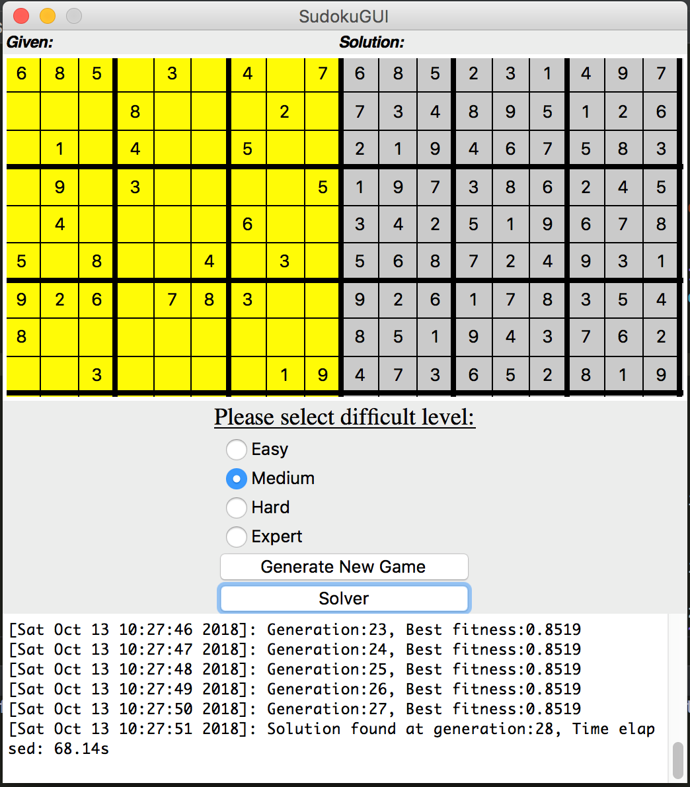
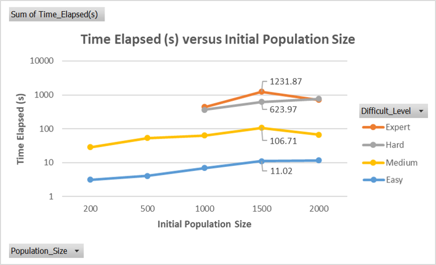

# Genetic-Algorithm-based-Sudoku-Solver
USER-INTERFACE (UI) FOR SUDOKU SOLVER

The application has two buttons and four radio buttons. The radio buttons are used to specify the Sudoku difficulty level. When it is selected, the user can proceed to click on the “Generate New Game” button. Once it is clicked, a new Sudoku problem is generated on the yellow 9x9 grid.

The “Solver” button is used to initiate the Sudoku solving process and the final solution is displayed on the grey 9x9 grid.

The display panel at the bottom prints out the current generation, its best fitness level from that generation during the optimization process. When a solution is found, the time and generation elapsed is displayed.

### Sudoku Solver GUI

### Performance
Note: Performance plot was manually tabulated generated using Excel

